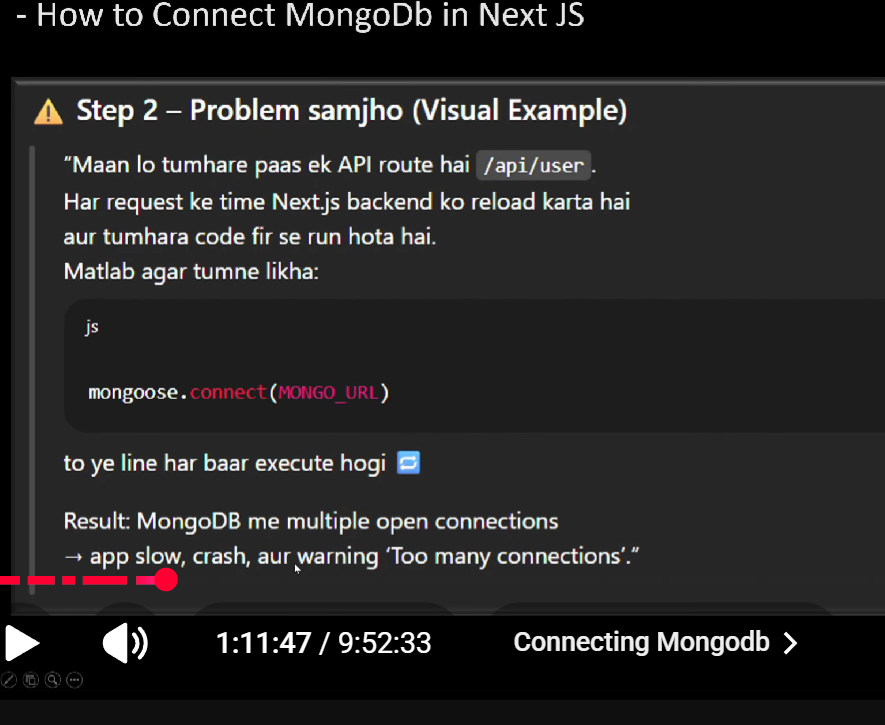
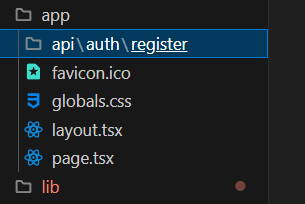

4️⃣ Why people say “Next.js is multi-server”

Because:

-> No single long-running server
-> Requests are handled independently
-> Platform automatically:
-> Starts servers
-> Stops servers
-> Scales servers

this global object is builtin in node.js

ts don't understands mongoose, so we must define it inside its global variables, we declare it inside global.d.ts file
global object in node.js is builtin and it has many fxns
as per ts rules if we write anything then it must exist, this is not with js but js will give the error during compile/run time

app mtlb hota ha slash,uske bad app jitne folders banate jaoge utne nam lgte jayenge in url